# Compilador Empire Earth

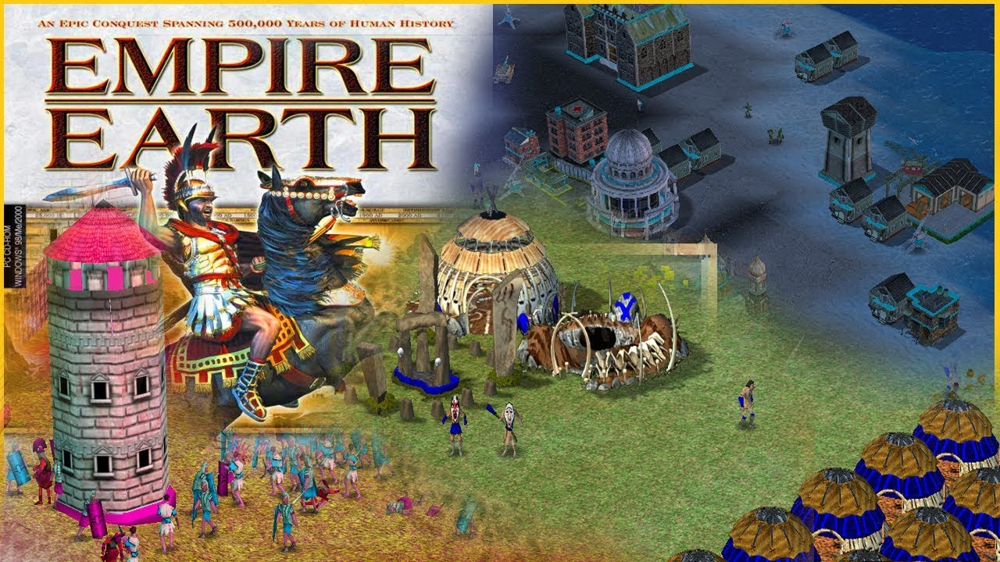

Proyecto final de Compiladores (IS-581). Es un compilador para un lenguaje que inventé basado en el juego Empire Earth. Las variables son "unidades" que se reclutan y cada tipo de dato es algo del juego.

Está hecho en C con Flex y Bison.

## El lenguaje

Todo programa empieza con `fundar_ciudad` y termina con `victoria`.

Para declarar se usa `reclutar`, y para asignar se usa `<-`:

```
fundar_ciudad
    reclutar recurso comida, madera, oro;
    reclutar epoca era <- 1;
    reclutar moral animo;
    reclutar heroe lider <- "Alejandro";
    reclutar aliado vecino;

    comida <- 200;
    madera <- 150;
    oro    <- comida;
    era    <- 5;
    animo  <- 1.75;
    vecino <- paz;
victoria
```

### Tipos

| Tipo | Qué guarda | Valor inicial |
|------|------------|---------------|
| recurso | números enteros (0 o más) | 0 |
| epoca | número entero del 1 al 14, como las épocas del juego | 1 |
| moral | números con decimales | 0.0 |
| heroe | texto entre comillas | "" |
| aliado | `paz` o `guerra` | guerra |

La `epoca` va del 1 al 14 porque en el juego hay 14 épocas, desde la Prehistoria hasta la Era Nano.

| | |
|---|---|
| 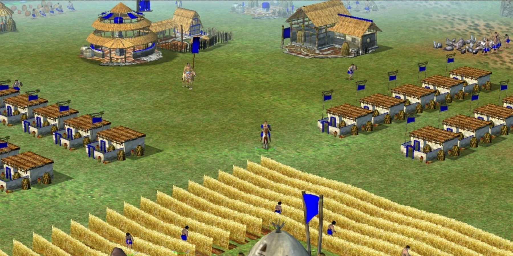 | 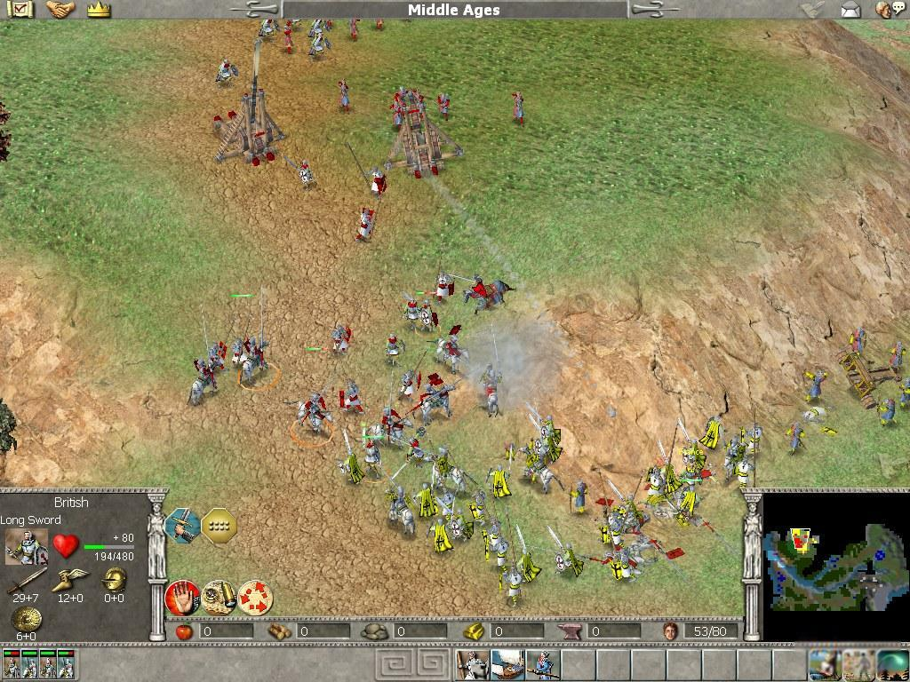 |
| Edad del Cobre | Edad Media |
| 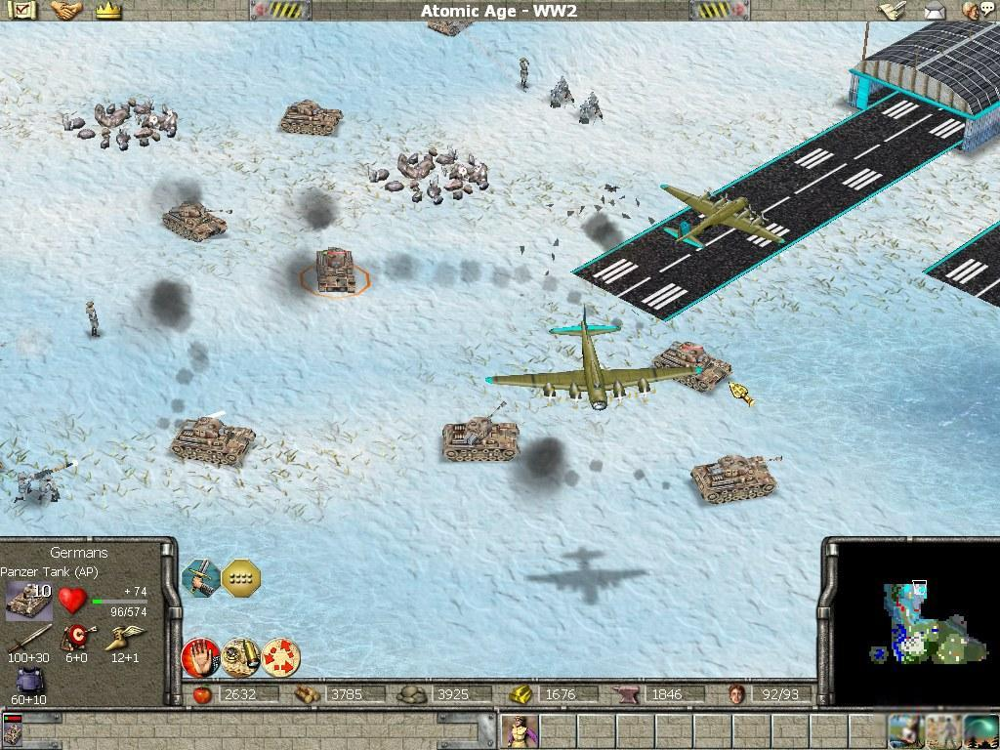 | 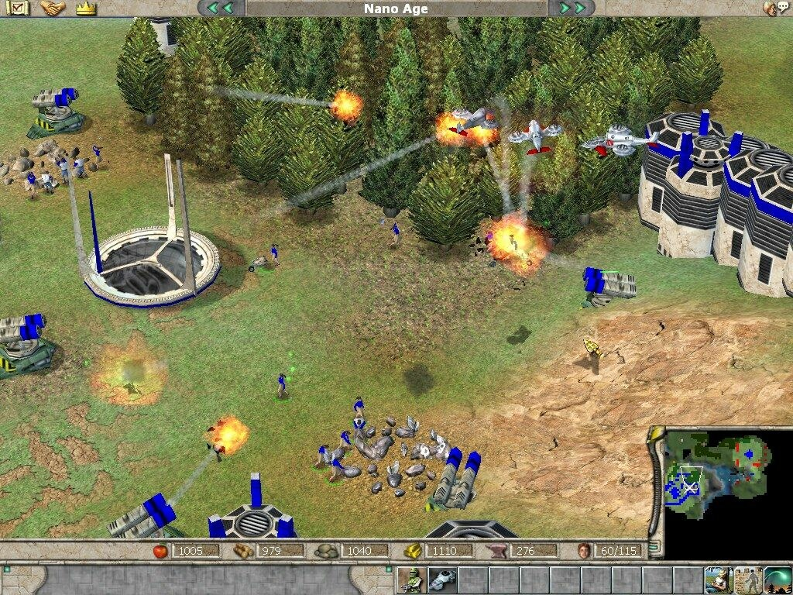 |
| Segunda Guerra Mundial | Era Nano |

### Reglas

- Cada instrucción termina en `;`.
- No se puede usar una unidad sin reclutarla antes.
- No se puede reclutar dos veces la misma unidad.
- El valor tiene que ser del tipo de la unidad. A una `moral` sí se le puede poner un entero.
- Una `epoca` solo puede valer de 1 a 14.
- Los nombres no pueden empezar con número ni llevar tildes o ñ.
- Los comentarios empiezan con `#`.

Si algo está mal el compilador muestra `DERROTA en la linea N:` y qué fue lo que pasó. Si todo sale bien muestra `VICTORIA`.

## Qué hace el compilador

1. Análisis léxico y sintáctico (`lexer.l` y `parser.y`)
2. Arma el árbol de sintaxis (AST) y lo muestra como tabla (`ast.c`)
3. Análisis semántico: revisa que las unidades existan y que los tipos cuadren (`semantic.c`)
4. Ejecuta el programa (`runtime.c`)
5. Muestra la tabla de símbolos con el valor final de cada unidad (`symbol_table.c`)

## Cómo correrlo

Se necesita `gcc`, `flex`, `bison` y `make`.

```
make
./compiler source.ee
```

Con `-t` también muestra los tokens:

```
./compiler -t source.ee
```

Para borrar lo compilado:

```
make clean
```

## Capturas del juego

| | |
|---|---|
| 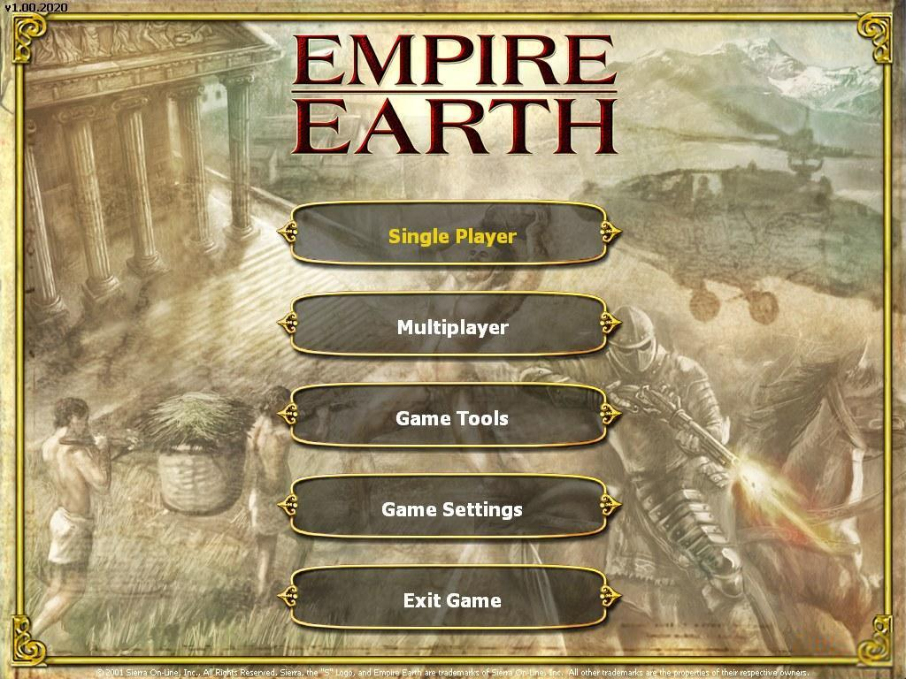 | 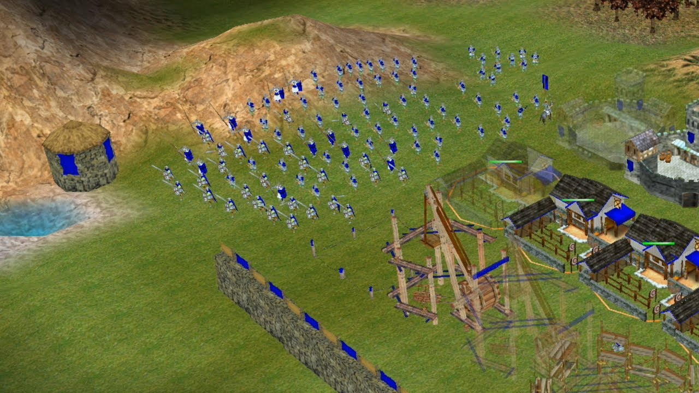 |
| 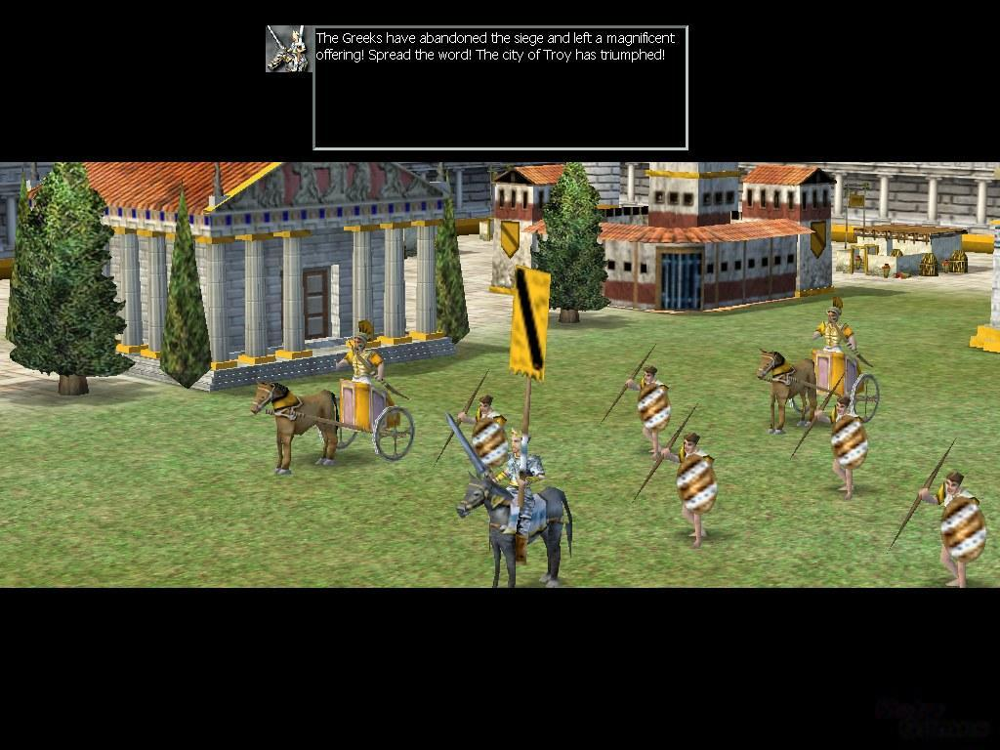 | 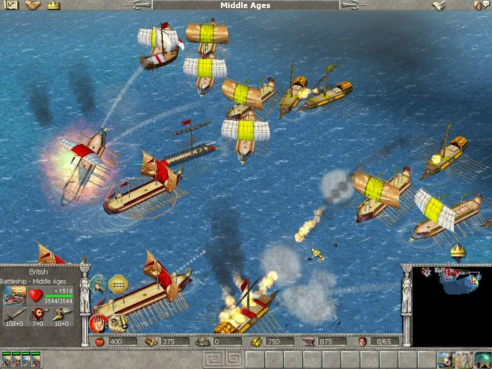 |
| 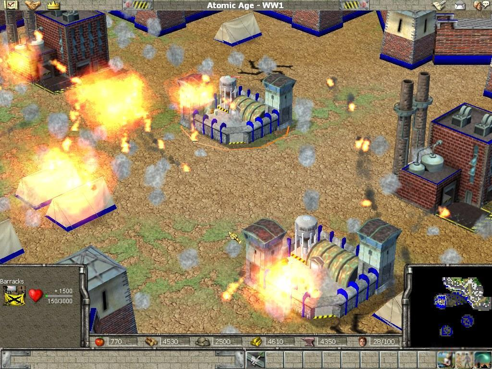 | 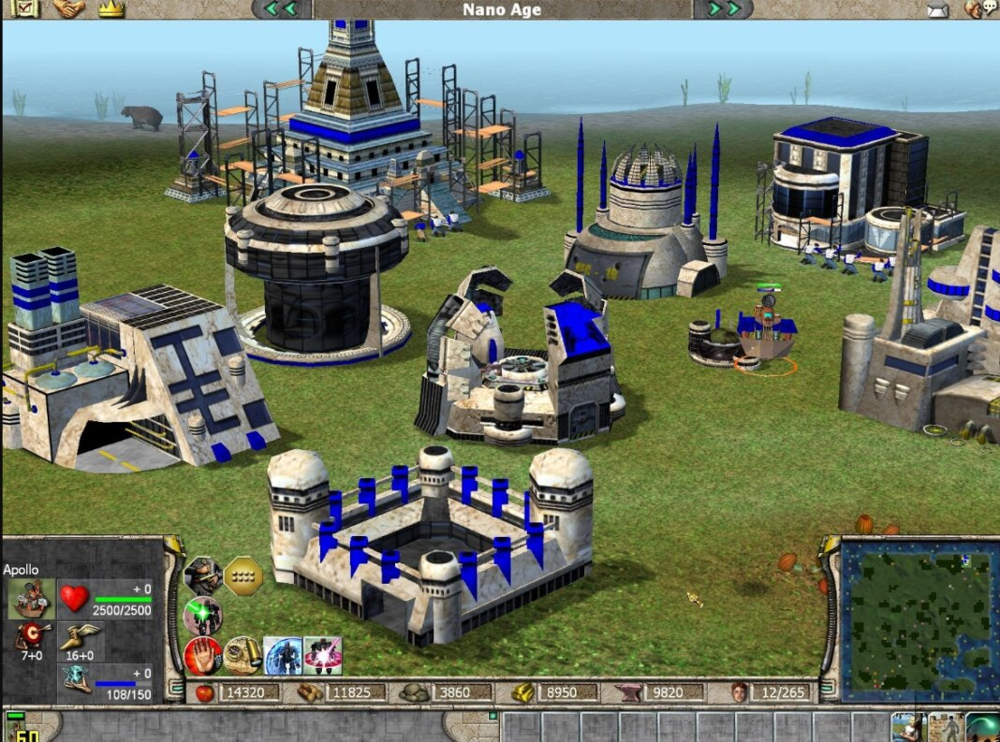 |
| 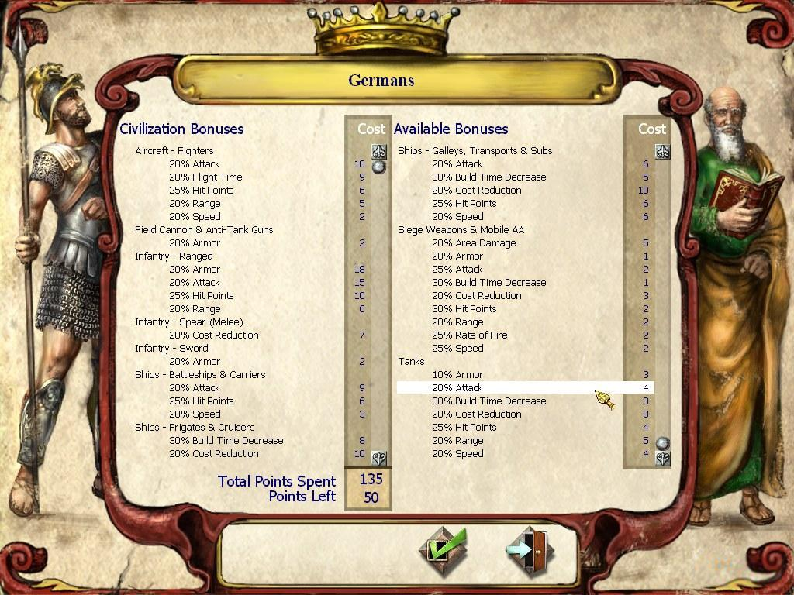 | 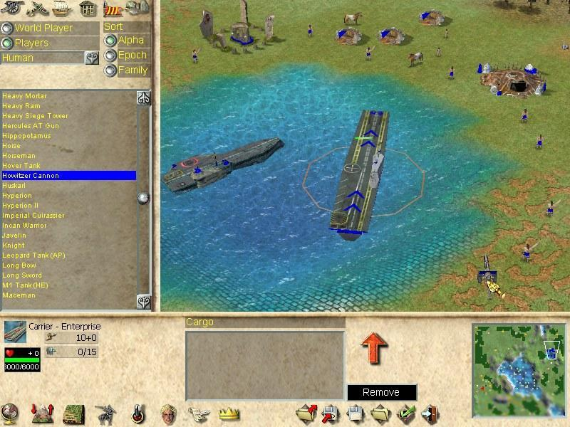 |
